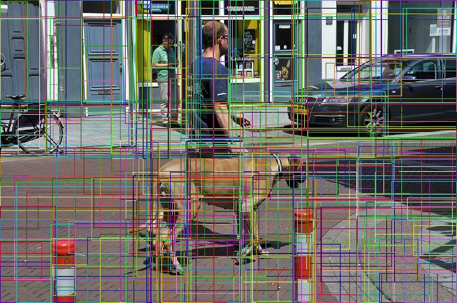

2016-05-09
==========

Labeling program for pixel wise recognition
-------------------------------------------

- http://github.com/wkentaro/labelme

.. image:: _images/labelme_screencast.gif

Label color utility function
----------------------------

- https://github.com/jsk-ros-pkg/jsk_recognition/pull/1658

Training FCN script
-------------------

- https://github.com/wkentaro/fcn/pull/20

Use crop function in FCN
------------------------

- https://github.com/wkentaro/fcn/pull/21
